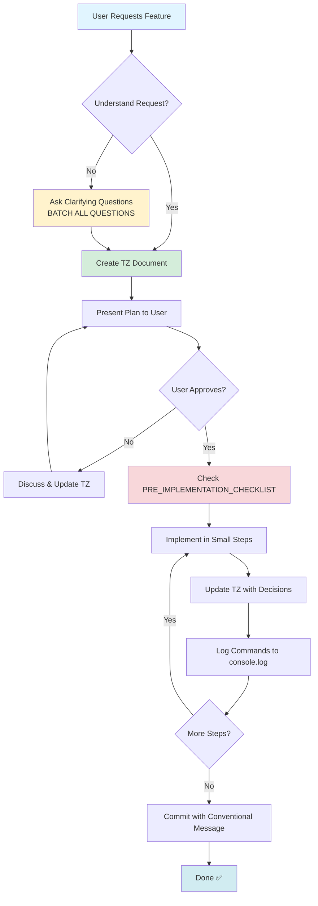
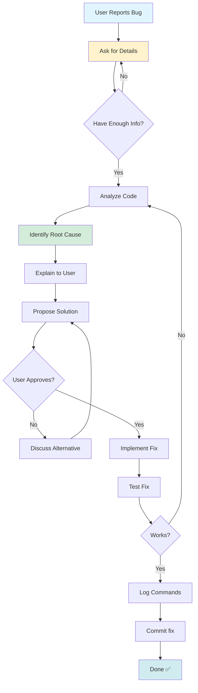
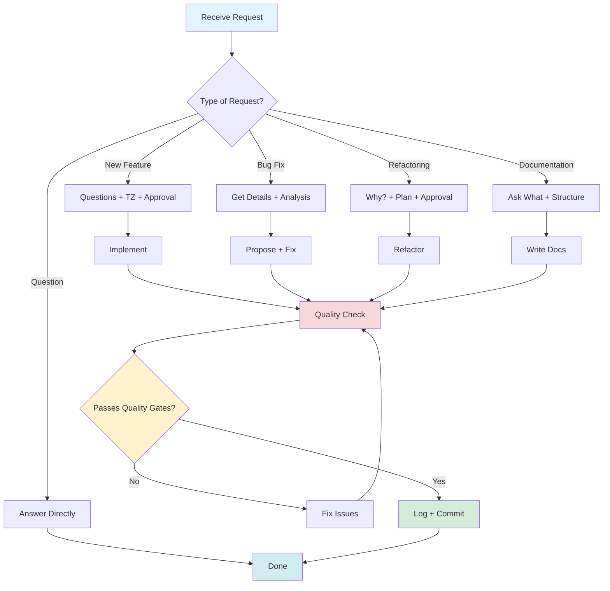

# Copilot Instructions

---
## 🚨 CRITICAL: READ THIS FIRST - AI AGENT MANDATORY CHECKLIST

**Before responding to ANY user request, you MUST:**

1. ✅ **CHECK** `docs/PRE_IMPLEMENTATION_CHECKLIST.md` if implementing features
2. ✅ **ASK QUESTIONS FIRST** - Never write code without clarifying requirements
3. ✅ **CREATE TZ** - Write technical specification before implementation
4. ✅ **BATCH ALL QUESTIONS** - Ask everything at once, not sequentially
5. ✅ **LOG COMMANDS** - Every `run_in_terminal` → `docs/console.log`
6. ✅ **FOLLOW STANDARDS** - Type hints, docstrings, code quality rules below

**NEVER:**
- ❌ Write code immediately without questions/TZ
- ❌ Skip creating technical specification
- ❌ Ask questions one-by-one (batch them!)
- ❌ Forget to update console.log
- ❌ Violate project conventions below

---

## Project Overview
This is a Python project. Follow these guidelines when working in this codebase.

## 🔴 AI Agent Workflow Rules (CRITICAL - ALWAYS FOLLOW)

### Communication Language
- **User Communication**: Always respond in the same language the user is using (Russian/English/etc.)
- **Code Comments**: Write in English for better international collaboration
- **Documentation**: Follow user's language preference - ask if unclear
- **Commit Messages**: Use English with conventional commits format

### Command Logging (MANDATORY)
- **All Terminal Commands**: Every command executed via `run_in_terminal` tool MUST be logged to `docs/console.log`
- **Format**: `[YYYY-MM-DD HH:MM:SS Category] command - description`
- **Purpose**: Maintain history of all executed commands for project documentation and debugging
- **Update**: Append to the file, never overwrite (keep full history)

### Token Efficiency
- **Read selectively**: Don't read entire large files - ask user for specific line ranges or sections
- **Avoid redundant reads**: If file content is already in context, don't re-read it
- **Summarize, don't repeat**: When explaining changes, reference line numbers instead of quoting full code blocks
- **Batch questions**: Ask all clarifying questions at once instead of one-by-one
- **Use targeted searches**: Use `grep_search` with specific patterns instead of reading multiple files
- **Minimize tool calls**: Plan before executing - one well-thought action beats multiple trial-and-error attempts

### 🔴 Communication Principles (NEVER VIOLATE)
1. **Never write code immediately** - Always ask and clarify requirements first
2. **Never create documentation immediately** - Discuss structure and content before writing
3. **Always plan before executing** - Break down tasks, discuss approach, get approval
4. **Confirm understanding** - Before writing code, explain what it will do and wait for confirmation
5. **Document decisions** - Key architectural or design decisions from conversations should be added to this file
6. **Create technical specification** - Before starting work, create a business/technical requirements document to understand the user's goal
7. **Update specification iteratively** - Update the requirements document with each user response to keep context clear
8. **Study reference projects** - When user provides example projects, thoroughly analyze them to understand patterns and approaches. Save references to `docs/examples/` for future context
9. **Incremental code generation** - Generate small, focused pieces of code and wait for confirmation before proceeding with large implementations

### Technical Specification (TZ) Management
- **Location**: Store technical specifications in `docs/tech_task/TZ-<feature-name>.md`
- **Format**: Use markdown with clear sections (Goal, Requirements, Architecture, API Design, etc.)
- **Updates**: Update the TZ file with each clarification from user to maintain context
- **Completion**: Mark TZ as "Implemented" when feature is complete, keep for reference

### TZ Template
```markdown
# TZ: [Feature Name]

## Business Goal
What problem are we solving?

## Functional Requirements
- Requirement 1
- Requirement 2

## Technical Decisions
- Database: [choice]
- Framework: [choice]
- Architecture patterns: [Repository, Service, etc.]

## API Design (if applicable)
Endpoints, request/response formats

## Implementation Plan
1. Step 1
2. Step 2

## Status
- [ ] In Progress
- [ ] Implemented
- [ ] Tested
```

### Pre-Implementation Checklist
**MANDATORY**: Before ANY code implementation, MUST check `docs/PRE_IMPLEMENTATION_CHECKLIST.md`:
- Verify Pydantic usage for data validation
- Verify observability-stack integration
- Verify Docker setup if needed
- Verify all dependencies from copilot-instructions.md
- Verify all requirements from TZ
- Verify project structure completeness
- Ask ALL clarifying questions in ONE batch, not sequentially

**Purpose**: Prevent missing critical requirements from copilot-instructions.md or TZ

### Task Execution Process
```
0. CHECK docs/PRE_IMPLEMENTATION_CHECKLIST.md - MANDATORY FIRST STEP!
1. User Request → Create/Update Technical Specification (TZ)
2. Clarify Requirements → Ask questions to understand business goal
3. Study References → If user provides example projects, analyze them and save to docs/examples/
4. Create Plan → Present task breakdown, get approval
5. Review Checklist → Go through PRE_IMPLEMENTATION_CHECKLIST.md, ask batch questions
6. Confirm Scope → Explain what code/changes will do
7. Execute → Implement approved plan (incrementally, small pieces)
8. Document → Add important decisions to copilot-instructions.md
```

### Examples
```
❌ Bad: User says "add authentication" → Immediately creates auth code
✅ Good: User says "add authentication" → Ask: "What type? (JWT/OAuth/Session)?
         What user model? Where to store credentials? Database choice?"
         Create TZ.md with business requirements and update after each answer

❌ Bad: User says "fix bug" → Makes changes immediately
✅ Good: User says "fix bug" → Ask: "Can you describe the bug? Expected vs actual behavior?
         Do you have error logs? Let me analyze the code first"

❌ Bad: User mentions "like in project X" → Ignores the reference
✅ Good: User mentions "like in project X" → "Let me study project X first to understand
         the pattern you want. I'll analyze its architecture and approach"

❌ Bad: Makes architectural decision silently
✅ Good: "I suggest using Repository pattern for data access. This will help with
         testing and follows SOLID principles. Should I add this to instructions?"
```

### Key Questions to Ask When Starting New Features
When user requests new functionality, clarify:
- **Application Type**: API, CLI tool, library, web application, data pipeline?
- **Database**: Will it use a database? Which one? (PostgreSQL, MySQL, MongoDB, SQLite?)
- **Async**: Does it need async/await? (I/O-bound operations, concurrent requests?)
- **External Integrations**: Third-party APIs or services to integrate with?
- **API Design**: REST, GraphQL, gRPC? Versioning strategy?
- **Authentication/Authorization**: Required? What type?
- **Data Migrations**: Database schema changes? Migration tool? (Alembic, Django migrations?)
- **Environment Configuration**: Dev/staging/prod specific settings?
- **Package Distribution**: Will this be published to PyPI? Private library? Standalone app?
- **Backwards Compatibility**: Public API requiring version compatibility? Internal project with flexible breaking changes?

## Python Environment
- **Python Version**: Use Python 3.11+ (check `pyproject.toml` or `requirements.txt` for specifics)
- **Package Manager**: Use `pip` with virtual environment (`.venv`)
- **Dependencies**: Install via `pip install -r requirements.txt` or `pip install -e .`
- **Container**: Docker for consistent development and deployment
- **Observability**: Use [observability-stack](https://github.com/antonbezkrovnyy/observability-stack) for logging and metrics

### Environment Setup
```bash
# Local development
python -m venv .venv
.venv\Scripts\activate  # Windows
pip install -r requirements.txt

# Docker development
docker-compose up --build
```

## Security Best Practices
- **Secrets Management**: Never commit secrets - use `.env` files (gitignored) or environment variables
- **Dependencies**: Regularly update dependencies, scan for vulnerabilities (`pip-audit` or `safety`)
- **Input Validation**: Always validate and sanitize user input
- **SQL Injection**: Use parameterized queries or ORM, never string concatenation
- **API Keys**: Store in environment variables, rotate regularly

### Example
```python
# Good: Using environment variables
import os
API_KEY = os.getenv("API_KEY")
if not API_KEY:
    raise ValueError("API_KEY environment variable is required")

# Bad: Hardcoded secrets
API_KEY = "sk-1234567890"  # Never do this!
```

## Project Structure
```
project/
├── src/                # Main source code
│   ├── __init__.py
│   ├── api/            # API endpoints/routes
│   ├── core/           # Core business logic
│   ├── models/         # Data models
│   ├── services/       # Service layer
│   ├── repositories/   # Data access layer
│   └── utils/          # Utility functions
├── tests/              # Test files (pytest)
│   ├── unit/           # Unit tests
│   ├── integration/    # Integration tests
│   └── conftest.py     # Pytest fixtures
├── docs/               # Documentation
│   ├── tech_task/      # Technical specifications for features
│   └── examples/       # Reference projects and code examples from user
├── .github/            # GitHub workflows and configs
├── docker/             # Dockerfiles and docker configs
├── config/             # Configuration files
├── scripts/            # Utility scripts (migrations, setup, etc.)
├── .env.example        # Example environment variables
├── .gitignore          # Git ignore patterns
├── Dockerfile          # Main application Dockerfile
├── docker-compose.yml  # Multi-container setup
├── requirements.txt    # Production dependencies
├── requirements-dev.txt # Development dependencies
└── pyproject.toml      # Project metadata and build config
```

## Code Conventions
- **Style**: Follow PEP 8, enforced by `black` (line length: 88) and `isort`
- **Type Hints**: Use type annotations for all function signatures
- **Docstrings**: Google-style docstrings for all public functions/classes
- **Imports**: Organize with `isort` - stdlib, third-party, local

### Naming Conventions
- **Variables & Functions**: `snake_case` (e.g., `user_name`, `get_user_data()`)
- **Classes**: `PascalCase` (e.g., `UserService`, `DatabaseConnection`)
- **Constants**: `UPPER_SNAKE_CASE` (e.g., `MAX_RETRIES`, `API_BASE_URL`)
- **Private members**: Prefix with `_` (e.g., `_internal_method`, `_private_var`)
- **Module names**: Short, lowercase, no underscores if possible (e.g., `auth.py`, `database.py`)

### Import Organization
```python
# Standard library imports
import os
import sys
from datetime import datetime
from typing import Optional, List

# Third-party imports
import requests
from fastapi import FastAPI
from sqlalchemy import create_engine

# Local application imports
from src.core.config import settings
from src.models.user import User
from src.services.auth import AuthService
```

### Example Function Pattern
```python
from typing import Optional

def process_data(input_value: str, max_length: Optional[int] = None) -> dict[str, Any]:
    """Process input data and return structured result.

    Args:
        input_value: The raw input string to process
        max_length: Optional maximum length for truncation

    Returns:
        Dictionary containing processed data with 'result' and 'metadata' keys

    Raises:
        ValueError: If input_value is empty
    """
    if not input_value:
        raise ValueError("input_value cannot be empty")
    # Implementation
```

## Testing
- **Framework**: pytest
- **Coverage**: Maintain >80% coverage (run `pytest --cov`)
- **Run Tests**: `pytest tests/`
- **Test Files**: Name pattern `test_*.py` or `*_test.py`
- **Fixtures**: Use `conftest.py` for shared test fixtures
- **Mocking**: Use `unittest.mock` or `pytest-mock` for external dependencies
- **Markers**: Use pytest markers for categorizing tests (`@pytest.mark.slow`, `@pytest.mark.integration`)

### Test Example
```python
import pytest
from unittest.mock import Mock

def test_user_activation(mock_user_repository):
    """Test user activation updates status correctly."""
    # Arrange
    user = User(id=1, active=False)
    mock_user_repository.get_by_id.return_value = user
    service = UserService(mock_user_repository)

    # Act
    service.activate_user(user.id)

    # Assert
    assert user.active is True
    mock_user_repository.save.assert_called_once_with(user)
```

## Development Workflow
1. Create feature branch: `git checkout -b feature/description`
2. Make changes with type hints and docstrings
3. Format code: `black . && isort .`
4. Run tests: `pytest`
5. Commit with conventional commits: `feat:`, `fix:`, `docs:`, etc.
6. Push and create Pull Request
7. Ensure CI passes before merging

### Git Workflow
- **Branch Naming**:
  - `feature/short-description` - New features
  - `bugfix/issue-number-description` - Bug fixes
  - `hotfix/critical-issue` - Production hotfixes
  - `refactor/component-name` - Code refactoring
- **Commit Messages**: Use conventional commits format
  ```
  feat: add user authentication endpoint
  fix: resolve database connection timeout
  docs: update API documentation
  refactor: simplify user service logic
  test: add integration tests for payments
  chore: update dependencies
  ```
- **Pull Request**:
  - Use descriptive titles
  - Link related issues
  - Request reviews before merging
  - Squash commits when merging to main
- **Merge Strategy**: Prefer rebase for feature branches, squash merge to main

## Error Handling Strategy
```python
# Good: Specific exceptions with context
class UserNotFoundError(Exception):
    """Raised when user cannot be found."""
    pass

def get_user(user_id: int) -> User:
    try:
        user = db.query(User).filter(User.id == user_id).first()
        if not user:
            raise UserNotFoundError(f"User {user_id} not found")
        return user
    except DatabaseError as e:
        logger.error(f"Database error retrieving user {user_id}: {e}")
        raise
    # Never use bare except:

# Bad: Generic exceptions
def get_user(user_id: int):
    try:
        return db.get(user_id)
    except:  # Too broad!
        return None  # Lost error context
```

## Performance Considerations
- **Database**: Use connection pooling, avoid N+1 queries
- **Caching**: Implement caching for expensive operations (Redis, in-memory)
- **Async I/O**: Use `asyncio` for I/O-bound operations
- **Profiling**: Use `cProfile` or `py-spy` to identify bottlenecks
- **Batch Operations**: Process data in batches, not one-by-one

## Common Commands
```bash
# Format code
black . && isort .

# Run tests with coverage
pytest --cov=src tests/

# Type checking
mypy src/

# Lint
flake8 src/

# Docker commands
docker-compose up --build        # Build and start services
docker-compose down              # Stop services
docker-compose logs -f           # View logs
docker exec -it <container> bash # Enter container shell
```

## Key Patterns
- **Error Handling**: Use specific exceptions, avoid bare `except:`
- **Logging**: Use `logging` module, not `print()` for production code
- **Configuration**: Store in `config/` directory or environment variables
- **Async Code**: Use `asyncio` with proper `async/await` syntax when needed

## Observability & Monitoring
- **Stack**: Use [observability-stack](https://github.com/antonbezkrovnyy/observability-stack) for centralized logging and metrics
- **Logging**:
  - Structure logs in JSON format for easier parsing
  - Include correlation IDs for request tracing
  - Use appropriate log levels (DEBUG, INFO, WARNING, ERROR, CRITICAL)
- **Metrics**:
  - Export application metrics (counters, gauges, histograms)
  - Monitor performance, errors, and business metrics
  - Integrate with observability-stack's Prometheus/Grafana setup
- **Integration**: Configure logging handlers to send logs to the observability stack

### Logging Example
```python
import logging
import json

logger = logging.getLogger(__name__)

# Structured logging
logger.info(json.dumps({
    "event": "user_created",
    "user_id": user.id,
    "correlation_id": request.correlation_id,
    "timestamp": datetime.utcnow().isoformat()
}))
```

## Design Principles

### KISS (Keep It Simple, Stupid)
- Prefer simple, readable solutions over clever code
- Break complex logic into smaller, focused functions
- Avoid over-engineering - implement what's needed now

### DRY (Don't Repeat Yourself)
- Extract repeated code into reusable functions/classes
- Use inheritance and composition to share behavior
- Create utilities for common operations

### SOLID Principles
1. **Single Responsibility**: Each class/function does one thing well
2. **Open/Closed**: Open for extension, closed for modification (use inheritance/composition)
3. **Liskov Substitution**: Derived classes must be substitutable for base classes
4. **Interface Segregation**: Many specific interfaces better than one general-purpose
5. **Dependency Inversion**: Depend on abstractions, not concrete implementations

### GRASP (General Responsibility Assignment Software Patterns)
- **Information Expert**: Assign responsibility to the class with the most information
- **Creator**: Class A creates B if A contains/aggregates/records B
- **Controller**: Handle system events with dedicated controller classes
- **Low Coupling**: Minimize dependencies between classes
- **High Cohesion**: Keep related functionality together in one class

### Practical Application
```python
# Good: Single Responsibility, Information Expert
class UserRepository:
    """Handles user data persistence."""

    def get_by_id(self, user_id: int) -> User:
        """Retrieve user by ID."""
        pass

class UserService:
    """Business logic for user operations."""

    def __init__(self, repo: UserRepository):
        self._repo = repo  # Dependency Inversion

    def activate_user(self, user_id: int) -> None:
        """Activate user account."""
        user = self._repo.get_by_id(user_id)
        user.activate()  # Information Expert - User knows how to activate itself
        self._repo.save(user)

# Bad: God class doing everything
class UserManager:
    def get_user_and_activate_and_send_email(self, user_id: int):
        # Too many responsibilities!
        pass
```

## Don't
- Don't commit `.venv/`, `__pycache__/`, `*.pyc` files
- Don't use `print()` for debugging - use `logging.debug()`
- Don't ignore type hints - they're required for new code
- Don't skip writing tests for new functionality

## Code Review Checklist
When reviewing code (or before committing), check:
- [ ] Type hints on all function signatures
- [ ] Docstrings for public functions/classes
- [ ] Tests cover new functionality
- [ ] No hardcoded secrets or credentials
- [ ] Error handling is specific, not generic
- [ ] Logging instead of print statements
- [ ] Code follows SOLID/GRASP principles
- [ ] No TODO comments without issue links

## Common Pitfalls to Avoid
```python
# ❌ Mutable default arguments
def add_item(item, items=[]):  # Bug: shared state!
    items.append(item)
    return items

# ✅ Use None and create new list
def add_item(item, items=None):
    if items is None:
        items = []
    items.append(item)
    return items

# ❌ Catching too broad
try:
    result = risky_operation()
except Exception:  # Too broad
    pass

# ✅ Catch specific exceptions
try:
    result = risky_operation()
except ValueError as e:
    logger.error(f"Invalid value: {e}")
    raise
except TimeoutError as e:
    logger.warning(f"Timeout occurred: {e}")
    return default_value
```

## Dependency Management
- **Requirements Files**: Use `requirements.txt` for production, `requirements-dev.txt` for development tools
- **Pinning**: Pin exact versions in production (`package==1.2.3`), allow flexibility in dev
- **Updates**: Review dependencies quarterly, check for security updates weekly
- **Vulnerability Scanning**: Run `pip-audit` or `safety check` before releases
- **Lock Files**: Consider using `pip-tools` or `poetry` for reproducible builds
- **Deprecation Warnings**: Monitor and address deprecation warnings during updates, plan migration before breaking changes

### Example
```bash
# Check for vulnerabilities
pip-audit

# Update specific package
pip install --upgrade package-name

# Generate requirements from current environment
pip freeze > requirements.txt

# Check for outdated packages
pip list --outdated
```

## CI/CD Guidelines
- **Pre-commit Checks**: Run locally before pushing (linting, formatting, type checking)
- **CI Pipeline**: Should run tests, linting, type checking, security scans
- **Test Coverage**: Fail build if coverage drops below threshold (e.g., 80%)
- **Deployment**: Automate to staging on merge to main, manual approval for production
- **Rollback Strategy**: Keep ability to quickly rollback to previous version
- **Database Migrations**: Test migrations in staging, keep rollback migrations for data changes

### Suggested CI Steps
```yaml
1. Install dependencies
2. Run black --check and isort --check
3. Run flake8 and mypy
4. Run pytest with coverage
5. Run security scan (pip-audit)
6. Build Docker image (if applicable)
7. Deploy to staging (on main branch)
8. Run database migrations (if applicable)
```

## Debugging & Troubleshooting
- **Debugger**: Use `debugpy` for VS Code, `pdb` for terminal debugging
- **Logging for Debug**: Use `logger.debug()` with detailed context, never `print()`
- **Stack Traces**: Always log full stack traces with `logger.exception()`
- **Reproduction**: Document steps to reproduce issues in bug reports
- **Environment**: Check environment variables, dependencies versions when debugging

### Debugging Example
```python
import logging

logger = logging.getLogger(__name__)

def process_payment(amount: float, user_id: int):
    logger.debug(f"Processing payment: amount={amount}, user_id={user_id}")
    try:
        # ... logic
        pass
    except Exception as e:
        logger.exception(f"Payment processing failed for user {user_id}")
        raise
```

## Data Validation
- **Libraries**: Use `pydantic` for data validation and settings management
- **Schema Validation**: Define clear schemas for all data structures
- **Input Sanitization**: Always validate and sanitize external input
- **Type Safety**: Leverage type hints with validators

### Example
```python
from pydantic import BaseModel, Field, validator

class UserCreate(BaseModel):
    email: str = Field(..., regex=r"^[\w\.-]+@[\w\.-]+\.\w+$")
    age: int = Field(..., ge=0, le=150)

    @validator('email')
    def email_must_be_lowercase(cls, v):
        return v.lower()
```

## Concurrency Patterns
- **Async I/O**: Use `asyncio` for I/O-bound operations (API calls, database queries)
- **Threading**: For I/O-bound operations when async is not available
- **Multiprocessing**: For CPU-bound operations (data processing, computations)
- **GIL Awareness**: Remember Python's GIL - threading won't help CPU-bound tasks
- **Thread Safety**: Use locks, queues, or thread-safe data structures when needed

### When to Use What
```python
# ✅ Async I/O for concurrent API calls
async def fetch_users():
    async with httpx.AsyncClient() as client:
        responses = await asyncio.gather(
            client.get('/users/1'),
            client.get('/users/2')
        )
    return responses

# ✅ Multiprocessing for CPU-intensive work
from multiprocessing import Pool

def process_data(data_chunk):
    return expensive_computation(data_chunk)

with Pool() as pool:
    results = pool.map(process_data, data_chunks)
```

## When to Update This File
Add to `.github/copilot-instructions.md` when:
- User makes important architectural decisions (database choice, framework, patterns)
- Specific coding standards are agreed upon
- Project-specific conventions emerge
- Integration approaches are decided
- Performance or security requirements are defined

---
## 🎯 AI AGENT QUICK REFERENCE (Always Visible)

### Before EVERY Response - Ask Yourself:
```
□ Did I check PRE_IMPLEMENTATION_CHECKLIST.md?
□ Did I ask ALL questions at once (not one-by-one)?
□ Did I create/update TZ before coding?
□ Will I log commands to console.log?
□ Am I following type hints + docstrings standards?
□ Am I using the user's language for communication?
```

### Critical Workflows by Task Type:

#### 🆕 New Feature Request:
```
1. ASK clarifying questions (batch them!)
2. CREATE docs/tech_task/TZ-<name>.md
3. WAIT for user confirmation
4. CHECK docs/PRE_IMPLEMENTATION_CHECKLIST.md
5. IMPLEMENT incrementally (small pieces)
6. UPDATE TZ with decisions
7. LOG all commands to console.log
```

#### 🐛 Bug Fix:
```
1. ASK for reproduction steps / logs
2. ANALYZE code (don't make assumptions)
3. EXPLAIN root cause to user
4. PROPOSE solution, wait for approval
5. IMPLEMENT fix
6. LOG commands
```

#### 📝 Documentation:
```
1. ASK what user wants documented
2. DISCUSS structure first
3. WAIT for approval
4. WRITE incrementally
5. Use user's language preference
```

#### 🔧 Refactoring:
```
1. ASK why refactoring is needed
2. EXPLAIN proposed changes
3. WAIT for confirmation
4. REFACTOR with tests
5. Maintain backward compatibility if needed
```

### Red Flags - STOP if you see these:
- 🚩 **No TZ exists** for new feature → Create one first!
- 🚩 **Asking questions sequentially** → Batch them!
- 🚩 **Writing code without confirmation** → Stop, ask first!
- 🚩 **No type hints/docstrings** → Add them!
- 🚩 **Forgot console.log** → Always update!
- 🚩 **Not using user's language** → Match their language!

### Quality Gates (Every Code Change):
```python
# Every function MUST have:
def example_function(param: str) -> dict[str, Any]:  # ✅ Type hints
    """Short description.                            # ✅ Docstring

    Args:
        param: Description

    Returns:
        Description

    Raises:
        ValueError: When...
    """
    if not param:                                    # ✅ Input validation
        raise ValueError("param required")

    logger.info("Processing", extra={"param": param})  # ✅ Logging
    return {"result": param}
```

### Command Logging Template:
```
[2025-11-06 HH:MM:SS Category] command - brief description

Categories: Testing, Environment, Dependencies, Docker, Git, QA, Code, Documentation, Config
```

### Communication Template:
```markdown
## Уточняющие вопросы: (if needed, batch ALL)
1. Question 1?
2. Question 2?
3. Question 3?

## Предлагаемый план: (always before coding)
1. Step 1
2. Step 2
3. Step 3

**Мне продолжить?** (wait for confirmation)
```

### Key Reminders:
- 🗣️ **Language**: Match user (Russian → Russian, English → English)
- 📋 **TZ First**: Never code without specification
- 🎯 **Batch Questions**: Ask everything at once
- 📝 **Log Commands**: Every terminal command → console.log
- ✅ **Quality**: Type hints + docstrings = mandatory
- 🔄 **Incremental**: Small steps, frequent confirmations
- 🚫 **No Assumptions**: When in doubt, ask!

---

## 📊 Visual Workflow Diagrams

### Feature Implementation Flow



### Bug Fix Flow



### Decision Making Process



---

## 🎓 Real Examples from This Project

### Good Example 1: Code Quality Tools Implementation

**User Request:** "добавляй mypy black isort flake8 и проверяй"

**AI Response:**
```markdown
## Уточняющие вопросы:

1. **Pre-commit hooks**: Автоматическая проверка перед каждым коммитом?
2. **CI/CD**: GitHub Actions для автоматической проверки при push/PR?
3. **mypy строгость**: Какой уровень? (--strict, --disallow-untyped-defs?)
4. **Конфигурация**: mypy в pyproject.toml или отдельный mypy.ini?
5. **Exclude paths**: Исключить migrations/, tests/, .venv/?
6. **requirements-dev.txt**: Обновить с версиями этих инструментов?

## Предлагаемый план:

1. Установка инструментов
2. Конфигурация (pyproject.toml)
3. Конфигурация (.flake8)
4. Проверка текущего кода
5. Исправление проблем
6. Опционально: Pre-commit hooks
7. Опционально: GitHub Actions

**Мне продолжить?**
```

**Result:** ✅ Perfect implementation, all questions answered upfront, clear plan

### Good Example 2: Bug Fix with Analysis

**User Report:** "это не правда, я проверял, сообщения в чатах есть"

**What AI Should Have Done (but didn't initially):**
```markdown
## Уточняющие вопросы:

1. **Какие именно чаты?** (@ru_python, @pythonstepikchat?)
2. **За какую дату?** (вчера, сегодня?)
3. **Есть ли логи?** Можете показать вывод Docker/local?
4. **Ожидаемое количество?** Примерно сколько сообщений должно быть?
5. **Как проверяли?** (через Telegram app, другой скрипт?)

## Предлагаемая диагностика:

1. Проверю логи fetcher
2. Создам test_fetch.py для валидации API
3. Проверю iter_messages параметры
4. Сравню с документацией Telethon

**Можете предоставить эту информацию?**
```

**What Actually Happened:** ❌ AI immediately started debugging without asking
**Lesson Learned:** ALWAYS ask for context before fixing bugs

### Bad Example (to avoid): Immediate Documentation

**User:** "создай README"
**Bad AI:** *immediately creates full README.md*

**Good AI Response:**
```markdown
## Уточняющие вопросы:

1. **Целевая аудитория**: Разработчики, пользователи, или оба?
2. **Язык**: Русский, английский, или оба?
3. **Что включить**:
   - Установка и настройка?
   - Примеры использования?
   - API документация?
   - Архитектура проекта?
4. **Структура**: Стандартный README или разбить на несколько файлов?

## Предлагаемая структура:

- Краткое описание
- Установка
- Быстрый старт
- Конфигурация
- Примеры
- Архитектура (ссылка на docs/)
- Разработка (contributing)

**Подходит?**
```

---
**Remember**: Following these rules prevents rework and ensures high-quality, maintainable code! 🎯
