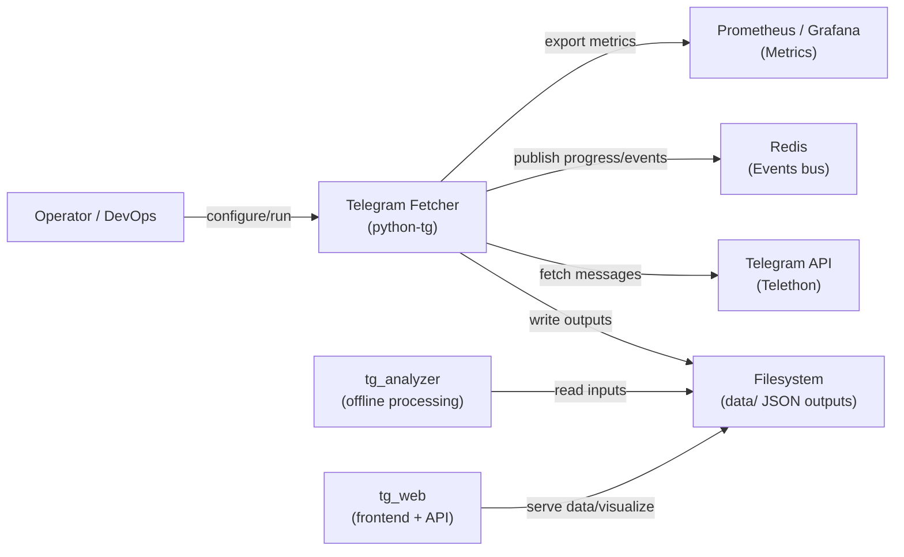

# C1 — System Context: Telegram Fetcher

This diagram shows the fetcher in its environment and who/what it interacts with.

Key points:
- Operator triggers fetches locally or in containerized environments.
- Telethon is the client SDK used against the Telegram API.
- Outputs (messages with enrichments) are persisted as JSON files under `data/`.
- Progress/events are optionally sent to Redis; metrics to Prometheus.
- Downstream systems (tg_analyzer, tg_web) consume produced data.