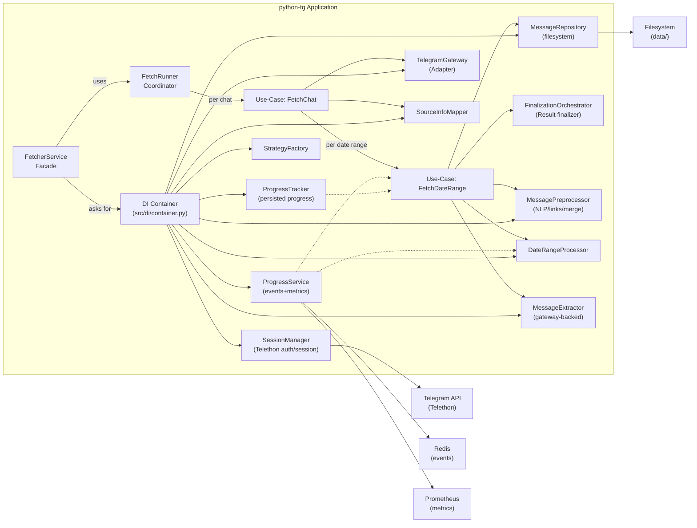

# C2 — Container Diagram: Fetcher app and external containers

Shows the high-level containers (runtime processes/services) and how they communicate.

Notes:
- FetcherService remains a thin entry point: it delegates to FetchRunner and pulls dependencies from the DI container.
- Use-cases encapsulate domain workflows; adapters (Gateway, Repository) isolate IO.
- Observability is centralized via ProgressService (Redis events + Prometheus metrics).
