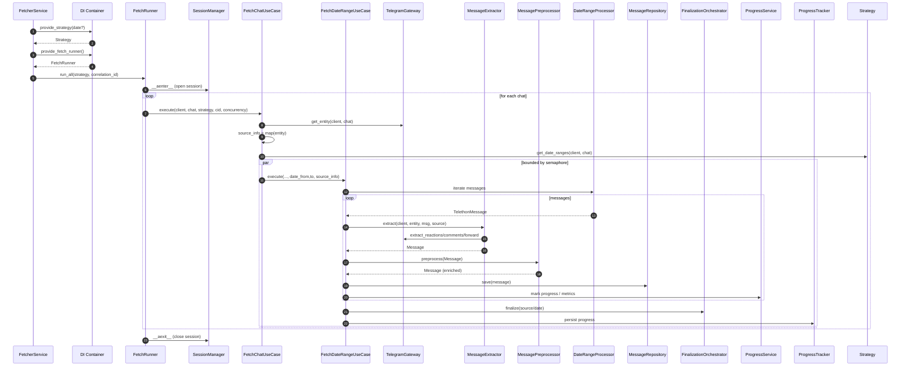

# C3 — Component Diagram: Core flow and responsibilities

Focus: how the application components collaborate to execute a full fetch.

Highlights:
- FetcherService orchestrates only at the top; it does not know message/extraction details.
- FetchRunner owns chat iteration and error handling.
- Use-cases separate chat-level orchestration from date-range processing.
- Extractor uses the gateway, preprocessor enriches, repository persists, services signal progress and finalize results.
