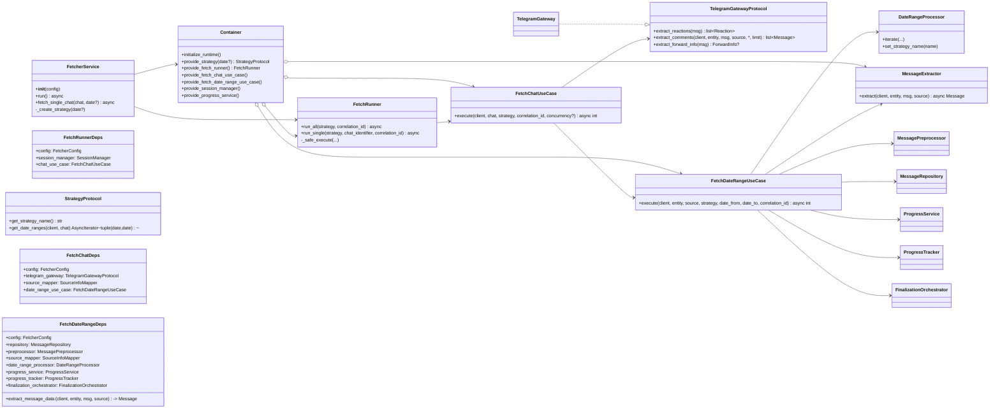

# C4 — Code/Classes: Key contracts and collaborators

A minimal code-level view of protocols and classes and their relationships.

Notes:
- Structural typing (protocols) keeps use-cases independent from concrete adapters.
- DI container centralizes composition; side-effects are in `initialize_runtime()`.
- FetcherService is a thin facade; orchestration lives in Runner + Use-cases.
