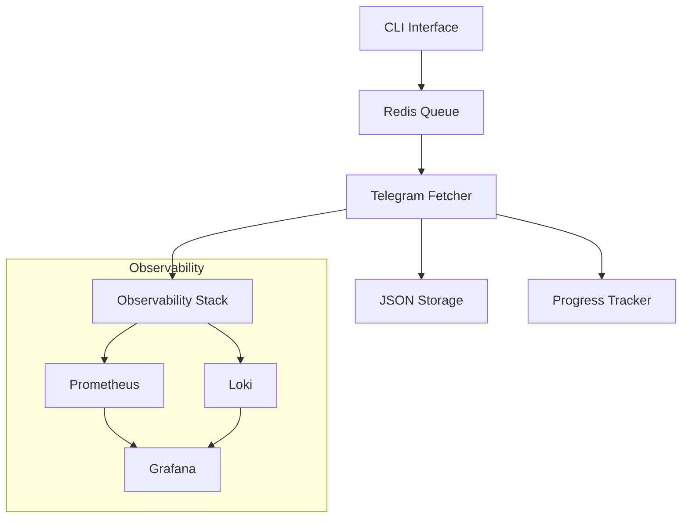

# Architecture Overview

## Components

## Core Components

### 1. Telegram Fetcher
- Главный сервис для скачивания сообщений
- Поддерживает разные стратегии фетчинга
- Асинхронный (asyncio + Telethon)
- Отслеживает прогресс
- Сохраняет сообщения в JSON

### 2. Strategy System
- **YesterdayStrategy**: Сообщения за вчера
- **ByDateStrategy**: За конкретную дату
- **FullHistoryStrategy**: Вся история до вчера
- **IncrementalStrategy**: От последней точки до вчера
- **RangeStrategy**: За указанный период

### 3. Progress Tracker
- Отслеживает прогресс скачивания
- Позволяет возобновлять после остановки
- Хранит метаданные по каждому чату

### 4. Message Repository
- Сохранение сообщений в JSON
- Версионирование схемы данных
- Валидация через Pydantic

## Observability Integration

### Метрики (Prometheus)
- Количество сообщений
- Время выполнения
- Ошибки и ретраи
- Использование памяти/CPU

### Логи (Loki)
- Структурированные JSON логи
- Трейсинг операций
- Контекст ошибок

### Мониторинг (Grafana)
- Дашборды по метрикам
- Визуализация логов
- Алерты

## Architecture Decisions

### 1. Command System
- Redis для очереди команд
- JSON формат команд
- Поддержка разных режимов

### 2. Data Storage
- JSON файлы по датам
- Простая структура для анализа
- Версионирование схемы

### 3. Error Handling
- Автоматические ретраи
- Логирование контекста
- Graceful degradation

### 4. Performance
- Асинхронное выполнение
- Батчинг сообщений
- Кэширование метаданных